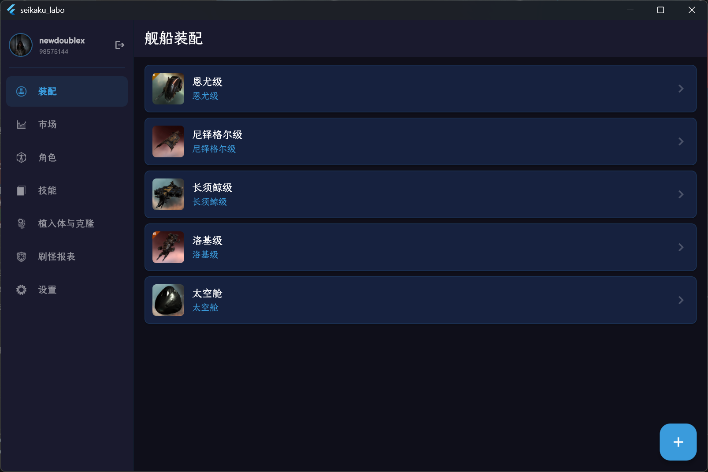
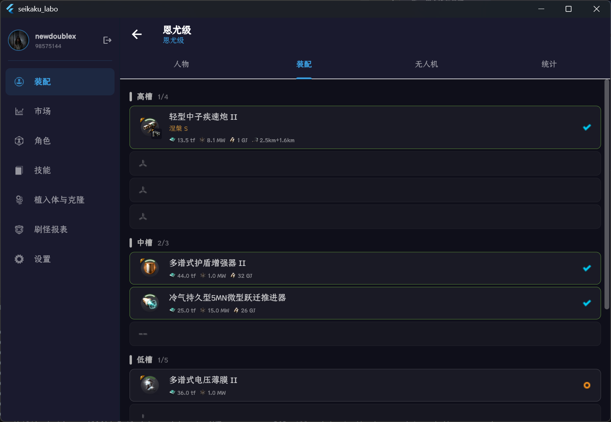
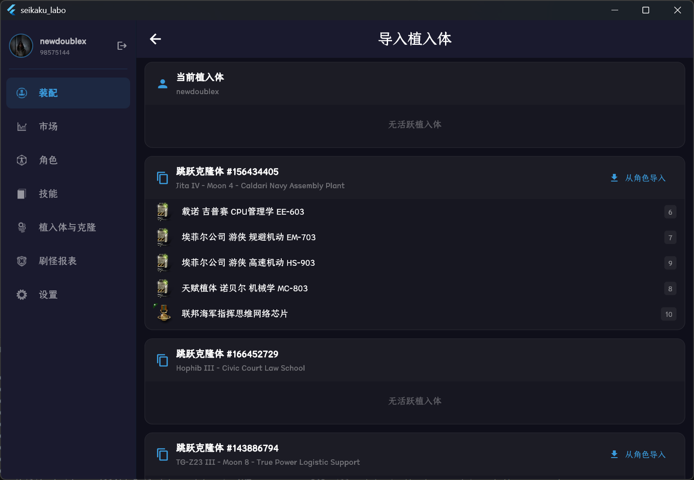
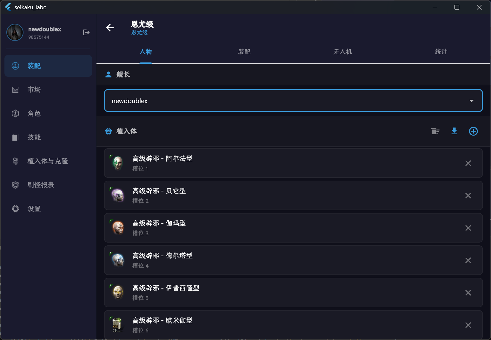
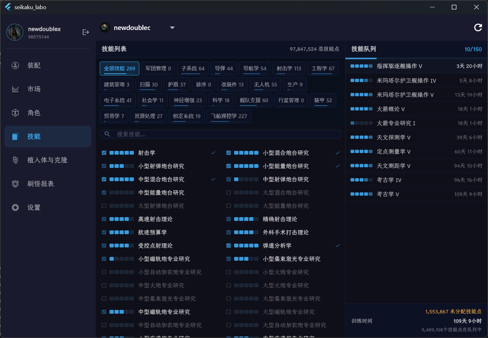
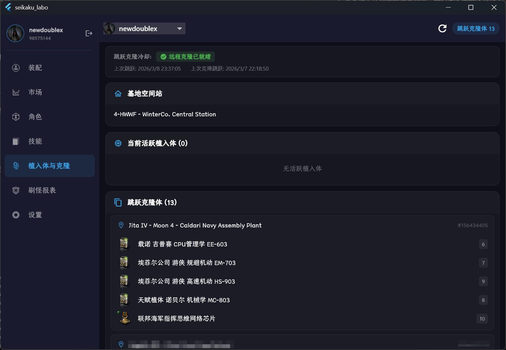
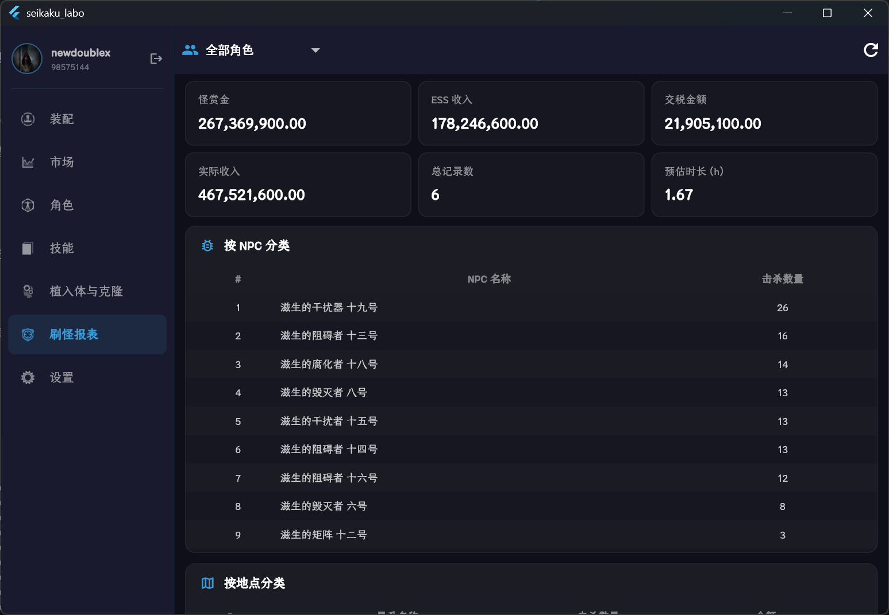

# Seikaku-Labo

EVE Online 跨平台装配模拟、角色信息APP

## 功能

### 装配模拟（Fitting）

> 快捷的装配模拟，支持导入ESI角色以及植入体

  
查看截图

  
  
  
  

### 技能 (Skill Queue)

> 角色技能信息展示，直观显示技能队列

  
查看截图

  

### 植入体&克隆 (Implants & Clones)

> 角色植入体和克隆信息展示，随时查看克隆冷却状态

  
查看截图

  

### 刷怪报表

> 角色刷怪报表展示，统计NPC击杀信息

  
查看截图

  

## 装配计算引擎

[Seikaku-Engine](https://github.com/zifox666/Seikaku-Engine) 是一个独立的装配计算引擎，使用 Rust 编写，提供高性能的装配模拟计算。Seikaku-Labo 通过 FFI 调用 Seikaku-Engine，实现了快速准确的装配模拟功能。该模块魔改于[EVEShip.fit/dogma-engine](https://github.com/EVEShipFit/dogma-engine)，新增了植入体计算支持。

## 数据处理后端

[AmiyaEden](https://github.com/zifox666/AmiyaEden) 是一个独立的数据处理后端，负责处理和存储 EVE Online 的角色数据，为 Seikaku-Labo 提供数据支持。你可以选择自行部署后端，并在APP设置里修改后端指向。

## 版权声明

All EVE related materials are property of CCP Games

CCP GAMES 版权声明
EVE Online 和 EVE 标志是 CCP hf. 的注册商标。全球所有权利均予保留。所有其他商标均为其各自所有者的财产。EVE Online、EVE 标志、EVE 以及所有相关标志和设计均为 CCP hf. 的知识产权。与这些商标相关的所有艺术作品、截图、角色、故事情节、世界事实或其他可识别的知识产权特征同样属于 CCP hf. 的知识产权。 本项目遵循 CCP GAMES 的使用许可条款，仅用于信息查询和非商业用途。本项目不隶属于 CCP hf.，也未得到 CCP hf. 的认可。CCP 对本项目的内容或功能不承担任何责任，也不对使用本项目而产生的任何损害承担责任。

License

本项目采用 GNU通用公共许可证v3.0（GPL-3.0）
